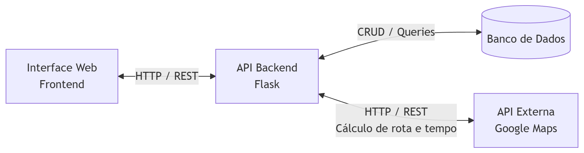

# Pizzaria Web App – MVP

Este projeto é um **MVP (Minimum Viable Product)** de uma aplicação web para uma pizzaria, desenvolvido com **arquitetura frontend e backend desacoplados**, utilizando **React (Vite)** no frontend e **Flask (Python)** no backend.

A aplicação permite:
- Cadastro e autenticação de clientes
- Consulta ao cardápio
- Cálculo de entrega utilizando API externa
- Criação de pedidos
- Visualização do histórico de pedidos por cliente

O objetivo do projeto é demonstrar conceitos de arquitetura de software, integração frontend–backend via **API REST**, consumo de **API Externa** e uso de **Docker em ambiente de desenvolvimento (DEV)**.

---

## Arquitetura da Aplicação

A aplicação segue uma arquitetura com frontend e backend separados, comunicação via **HTTP/REST**, acesso a banco de dados e consumo de **API externa**.

## Fluxograma da Arquitetura

Descrição do Fluxo

O Frontend, desenvolvido em React, é responsável pela interface com o usuário.
As ações do usuário disparam requisições HTTP para a API REST do Backend.
O Backend, desenvolvido em Flask, aplica as regras de negócio (login, pedidos, entrega).
O Backend tambem faz comunicação com a API do Google Maps para calcular o tempo de entrega
Os dados são armazenados em um banco de dados.
As respostas retornam ao frontend no formato JSON para atualização da interface.

## Tecnologias Utilizadas

- Python 3
- Flask
- Flask-CORS
- SQLite
- Docker

## Instalação e Execução (Ambiente de Desenvolvimento)

O projeto foi configurado para rodar em ambiente DEV, utilizando Docker para facilitar a configuração do ambiente local e evitar dependências manuais.

Pré-requisitos
Antes de iniciar, é necessário ter instalado:
Docker
Docker Compose

Executando o Backend:

Na pasta raiz execute:
docker compose up --build

O backend estará disponível em:
http://localhost:8000

A documentação da API (Swagger) pode ser acessada em:
http://localhost:8000/apidocs

## Organização do Projeto

O projeto está organizado de forma modular

backend/
 ├─ Dockerfile
 ├─ docker-compose.yml
 ├─ .env
 ├─ data/
 ├─ db/
 └─ api/

### Considerações

- A ideia foi montar algo a fim de atender a necessidade de um aplicativo/site de uma pizzaria
- Por ser um MVP o projeto não esta 100% completo, pode expandir para ter um usuario administrador por exemplo, assim realizando cadastro de itens menu, alterações de preço, etc. Tambem é possivel expandir para ajustes do próprio usuario, como mostrar em prioridade sua pizza favorita, ou até mesmo alterar os dados cadastrais.
- A ideia é mostrar o acesso de uma API interna (rodando em um servidor local por exemplo) acessando uma API externa e trabalhando essa informação
- A base do frontend foi utilizada como MVP da disciplina Desenvolvimento Frontend Avançado por esse motivo resolvi não utilizar blibioteca de componentes, como tudo foi feito em css local, é facil de alterar e ajustar o item especifico
- Os detalhes do .env do backend foram enviados separadamente aos professores para acesso a API do Google Maps. Na atualidade, baseado na quantidade de uso, a API é gratuita.